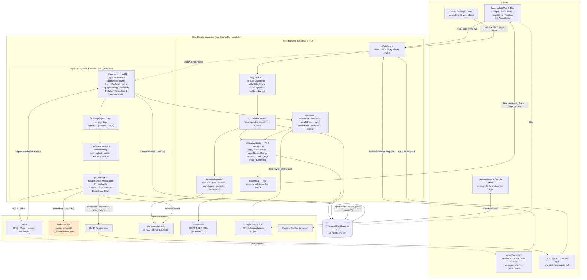
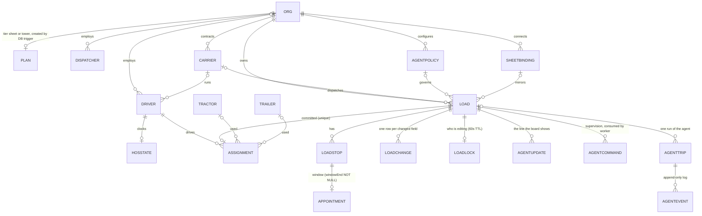
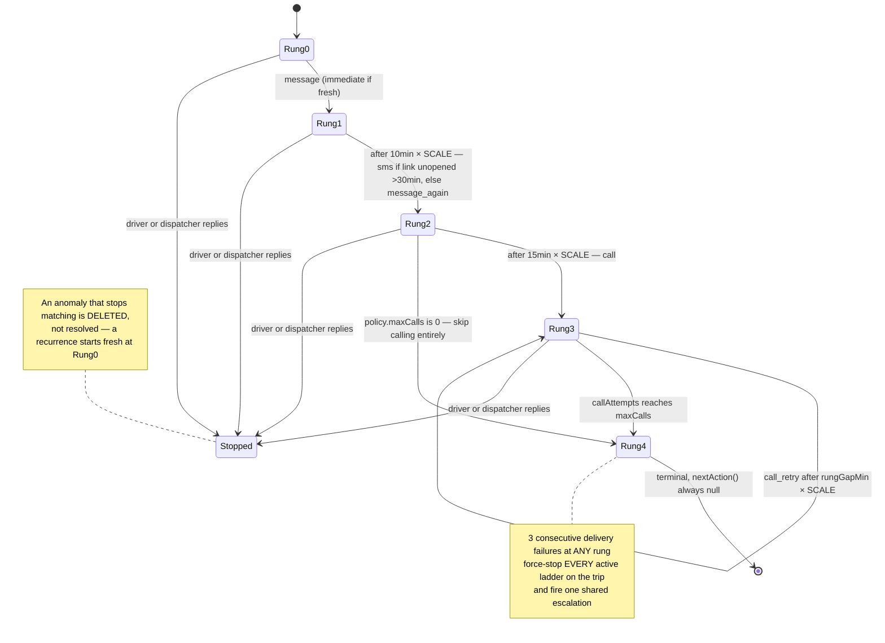

# Current System Architecture — what exists today

**Date:** 2026-09-24
**Scope:** the whole repository, as it stands in the working tree on branch `feat/dispatch-control-tower` (local HEAD `3aaddca`; GitHub `naumce/fleet` `main` = `8c892a3`; the Render deployment is older — `56c53ac`).
**Purpose:** a map of what is implemented **now**, produced as the input to a later decision about an LLM/AI orchestration layer. This document proposes nothing and changes nothing. Where a thing does not exist, it says so.

**How to read it.** Every claim carries a `file:line`. "Hard-coded" means only an engineer editing the file can change the value; "configurable" means a dispatcher or org can change it through the product. Sections 1–7 are description. Section 8 only *marks* existing decision sites with `[AI CANDIDATE]` — it does not design anything.

---

## 0. Executive summary

### What the system is

Two products on one Express/Postgres/Vue platform, separated by one field (`Plan.tier` = `"sheet"` | `"tower"`, `fleet-backend/prisma/schema.prisma:413-417`):

- **Control Tower** — a dispatch board for a carrier/broker: loads on a time axis, a map, drivers, carriers, HOS, detention, money. Loads are `Load` rows; committing one to a driver creates an `Assignment` after a server-side feasibility engine runs.
- **Night Shift** — an overnight monitoring agent that watches one truck per switched-on load: plans the route and the mandatory break, reads GPS, detects four anomaly kinds, climbs a five-rung contact ladder (chat → SMS → call → retry → escalate), classifies the driver's answer, emails the dispatcher, drafts the customer note. Sold to dispatchers who keep working in their own Google Sheet: a sheet row is mirrored into a `Load`, two added columns are the switch and the status.

### Six facts that matter most for the AI question

1. **An LLM is already in the loop, in production, today.** `night-shift/src/live/claudeConversation.ts` wires `claude-sonnet-5` (`:19`) as *both* the `ConversationPort` (what the agent says next on a live phone call) and the `ClassifierPort` (what a typed driver reply means). It is gated on `ANTHROPIC_API_KEY`; absent, the system falls back to a keyword matcher and one-question calls (`night-shift/src/live/worker.ts:66,79`). Any "add an AI layer" work starts by extending or replacing an existing seam, not by cutting a new one.
2. **That seam is deliberately narrow.** The model is forced to answer with exactly one tool call, `next_step`, whose schema is `{say, done, situationKey, confidence, summary}` (`claudeConversation.ts:23-37,96-98`). It cannot send, promise, route, or escalate. The port's own doc-comment states the rule (`night-shift/src/ports/index.ts:96-98`). Every *action* remains the deterministic ladder's.
3. **All planning, HOS and threshold math is deterministic and explicitly walled off from a model** — `plan.ts`, `itinerary.ts`, `detect.ts`, `ladder.ts`, and `fleet-backend/src/domain/dispatch/hos.ts:3` ("An LLM must never decide this — it is deterministic law").
4. **The decision surface is large and almost entirely hard-coded.** Section 7 inventories ~120 named rules across detection, ladder, planning, sheet sync, the load writer, dispatch scoring, detention, and commission. A handful are per-org configurable (`AgentPolicy`, `UpdateRule`, `RateConfig`, `detentionFreeMin`); the rest are constants.
5. **There is no single `Event` table, no `Alert`, no `Escalation`, no `Call`, no `Customer`, no `Route`, no stored `ETA`.** Those concepts exist as rows in `AgentEvent` / `LoadChange` / `AgentUpdate`, as enum-ish strings, or as values computed on demand (§3).
6. **The agent's live state is entirely in memory.** `Registry`, `TripState`, ladders, the open question, the pings buffer (`night-shift/src/live/registry.ts:44`, `core/agent.ts:16-39`). A worker restart mid-night starts a **brand-new trip** for every watched load and re-sends the invite SMS (`platformLoads.ts:269-285`); there is no resume path.

### Scale

| Package | Purpose | Files | Lines | Tests |
|---|---|---|---|---|
| `fleet-backend/src` | Express API, domain engines, sheet layer, realtime | 158 | 19,300 | 162 spec files |
| `fleet-portal/src` | Vue 3 dispatcher SPA | 244 | 39,301 | 103 spec files |
| `night-shift/src` | The monitoring agent + worker | 51 | 4,935 | 42 spec files |
| `night-shift-mcp/src` | MCP server (12 tools over the API) | 3 | 338 | 2 spec files |

---

## 1. System architecture



**Notes on the diagram.**
- The deployed topology is **one container** (`Dockerfile:1-32`, `start.sh`): migrate → worker (`:3010`) → backend (`$PORT`), with the backend serving the built SPA and proxying `/d`, `/act`, `/twilio` to the worker (`fleet-backend/src/lib/hosting.ts:14,21-38,43-53`). `docker-compose.yml` defines a *different*, nginx-fronted topology that is **not** what runs (and wires no worker at all).
- The worker imports `fleet-backend`'s Prisma client and its sheet-sync module directly (`night-shift/src/live/worker.ts:32`) — the two packages share one database and, in production, one process tree.
- There is **no driver mobile app in this repository.** `fleet-backend` exposes a full driver REST surface (`/api/driver`, `/api/trips`, …) that nothing here consumes; the working "driver app" is the worker's server-rendered `driverPage.html`.

---

## 2. Load lifecycle

Two genuinely different lifecycles exist. Both are live.

### 2a. The Control Tower lifecycle (`Load` + `Assignment`)

```mermaid
sequenceDiagram
    autonumber
    participant SRC as Source (sheet / CSV / webhook / manual)
    participant API as fleet-backend routes
    participant W as loadWriter.applyLoadChange
    participant DB as Postgres
    participant ENG as domain/dispatch/evaluate
    participant WS as realtime /ws
    participant UI as fleet-portal

    Note over SRC,DB: CREATE / IMPORT
    SRC->>API: POST /import/loads · /webhooks/loads · broker-board/import · sheet sync
    API->>W: applyLoadChange(patch, source, attention[])
    W->>W: deriveStops (gazetteer only, in-tx)<br/>deriveAppointments (apptText)<br/>deriveStatus (UpdateRule words)
    W->>DB: Load + LoadStop + Appointment<br/>one LoadChange per field, version+1
    W->>WS: emitLoadChanged(orgId,{loadId,version,fields})
    WS->>UI: load_changed → coalesced patch-by-id
    API-->>DB: settlePendingStops (provider geocode, AFTER commit)

    Note over API,ENG: ASSIGN (feasibility first, always server-side)
    UI->>API: GET /suggest?loadId  (rank drivers)
    API->>ENG: evaluate() per candidate
    ENG-->>API: feasible? conflicts[] plan{start,end,driveMin,breaks}
    API-->>UI: rows scored 0-100 (weights 30/30/15/15/5/5)
    UI->>API: POST /assignments {driverId,tractorId,trailerId,tender?}
    API->>ENG: re-evaluate inside Serializable tx
    API->>DB: Assignment + Rate (+DeadheadLeg)<br/>HosState decremented (snapshot kept)<br/>applyStatusChange → assigned|tendered<br/>surviving DispatchConflicts
    API->>WS: trip_assignment / trip_tender + load_changed

    Note over UI,DB: EXECUTE
    UI->>API: POST /assignments/:id/status {in_progress}
    API->>DB: applyStatusChange → in_progress
    Note right of DB: DriverLocation rows arrive from the driver API<br/>(or, for a watched load, the Night Shift link)
    UI->>API: GET /risk · /detention · /tracking
    API-->>UI: late_start|behind_schedule rows; dwell claims

    Note over UI,DB: COMPLETE
    UI->>API: POST /assignments/:id/status {completed}
    API->>DB: applyStatusChange → delivered<br/>trailer last position stamped
    API->>WS: trip_completed + load_changed
```

### 2b. The Night Shift monitoring lifecycle

This is the sequence the question "monitoring begins → location → ETA → anomaly → escalation → communication" actually maps onto. It is driven by the 60 s worker tick, not by the request path above.

```mermaid
sequenceDiagram
    autonumber
    participant Sheet as Google Sheet / Board
    participant DB as Postgres
    participant Poll as worker.poll() every 60s
    participant PL as platformLoads
    participant Ag as core/agent.ts
    participant Page as driverPage.html
    participant Tw as Twilio
    participant Cl as ClaudeConversation
    participant Mail as SmtpMailer

    Sheet->>DB: switch cell = a policy name → Load.agentEnabled = true
    Poll->>PL: syncPlatformLoads
    PL->>DB: findMany(agentEnabled:true), group by org, policyFor(load)
    PL->>PL: buildBrief — needs geocoded PU+DEL, PU/DEL appointments,<br/>a driver/carrier phone. Missing any → agentPill="attention", retry next poll
    PL->>Ag: registry.start(brief, policy) → agent.start()
    Ag->>Ag: buildPlan: route + mandatory break (HOS known?) + itinerary + ETA
    Ag->>DB: AgentEvent{kind:"plan"}
    alt itinerary says hours cannot carry the run
        Ag->>Mail: escalate("hours cannot carry this run") BEFORE any driver contact
    end
    Ag->>Tw: invite SMS (+ driver link appended to every SMS)

    Page->>Ag: POST /d/:token/accept → onAccept()
    loop watchPosition, ≥50 m or ≥60 s
        Page->>Ag: POST /d/:token/ping → onPing() → evaluate()
    end
    Note over Poll,Ag: platformPings.feed also merges the fleet's own<br/>DriverLocation rows through the SAME onPing()

    loop every tick while tracking
        Ag->>Ag: arrival? break compliance? detectAnomalies()
        Note right of Ag: 4 detectors, each independent:<br/>unplanned_stop · delay · gone_dark · off_route
    end

    Ag->>Ag: new anomaly → initialLadder(), one open question at a time
    Ag->>Page: rung 1 — chat message
    Ag->>Tw: rung 2 — SMS (if link unopened >30 min) or repeat
    Ag->>Tw: rung 3 — voice call
    Tw->>Cl: gather → converse() (≤4 driver turns, tool-forced)
    Cl-->>Tw: next line to say / sign-off + situationKey + confidence
    Tw-->>Ag: CallOutcome{answered, transcript, confidence}
    Ag->>Ag: handleReply — STT below CLASSIFY_FLOOR(0.7) ⇒ unknown;<br/>else verdict, else classifier.classify()
    Ag->>DB: AgentEvent{kind:"reply", situationKey, confidence}
    alt situation unknown, or level ≥ 2
        Ag->>Ag: escalate()
    else level 0-1
        Ag->>Page: canned response, ladder stopped ("replied")
    end

    Ag->>Ag: escalate(): live ETA, deadlineAtRisk,<br/>customer draft unless the fix is stale (>5 min)
    Ag->>Mail: dispatcher email, whole event log + draft attachment + signed action link
    Ag->>DB: AgentEvent{kind:"escalation"} → agentPill="escalated"
    Ag->>Tw: callDispatcher() — spoken briefing, listen:false
    Mail->>Ag: GET /act/:signed → onDispatcherReply("send the customer email")
    Ag->>Mail: the customer is told (only on a human's click)

    Ag->>Ag: within 0.5 mi of destination, dwelling ≥5 min → arrive()
    alt on time
        Ag->>Mail: customer arrival note sent immediately
    else late
        Ag->>Mail: dispatcher gets a DRAFT — never the customer, never unilaterally
    end
    Ag->>DB: agentPill="delivered"
    Poll->>PL: stopFinishedLoads → registry.stop(tripId)
```

---

## 3. Domain model

58 Prisma models in `fleet-backend/prisma/schema.prisma`. Two eras share the file: an older mobile-driver domain (`Trip`, `Stop`, `Vehicle`, `Conversation`, `Message`, `Notification`, …, no `orgId`) and the Control Tower domain (everything from `:266` down, org-scoped). **Both are mounted and live**; neither is marked deprecated.



### The entities you asked about — what is really there

| You asked about | Reality | Where |
|---|---|---|
| **Load** | Exists. The centre of the CT domain. | `schema.prisma:638` |
| **Driver** | Exists — **one table serves both** the mobile-app login and the dispatchable CT driver. | `:10` |
| **Customer** | **No entity.** `Load.customerName`, `Load.customerEmail` are scalars on the load. No lookup, no history, no list-by-customer. | `:658,708` |
| **Broker** | **No entity.** `Load.brokerName` is free text. (Contrast `Carrier`, which *is* a full entity.) | `:653`, `:499` |
| **Route** | **No per-load route record.** `RouteDistance`/`RoutePoiCache` are provider caches keyed by rounded coordinate pairs. Geometry is fetched on demand and never tied to a load id. | `:274,296` |
| **Stop** | Exists **twice, unrelated**: `Stop` (old Trip domain) and `LoadStop` (CT). | `:78`, `:732` |
| **Location** | No shared entity. `DriverLocation` (raw pings, **no Prisma relation** to Driver — a plain indexed string), `LocationRequest` (consent flow), plus `lastLat/lastLng` scalars on Driver/Tractor/Trailer. | `:168,316` |
| **TrackingSession** | **No table.** Split between `AgentTrip` (persisted run + status) and the in-memory `Registry`. `DriverSession` is the unrelated older clock-in/break table. | `:934`, `registry.ts:44`, `:209` |
| **ETA** | **Never stored anywhere.** Computed live. The schema documents an `AgentUpdate.kind = "eta"` that production code never writes (`kindFor()` can only return attention/delivered/would_say/status). | `:1006`, `platformSheet.ts:39-43` |
| **Event** | No single table. Split across `AgentEvent` (agent log), `LoadChange` (field audit), `AgentUpdate` (board line), `ImportBatch`. | `:993,1051,1007,848` |
| **Alert** | **No CT alert feed.** `SafetyAlert` is the old mobile panic table; `DispatchConflict` is the closest analog (commit-time block/warn). | `:220`, `:859` |
| **Escalation** | **No table.** It is `AgentEvent.kind = "escalation"` plus `Load.agentPill = "escalated"`. There is no queryable "open escalations" list. | `agent.ts:566`, `platformSheet.ts:50` |
| **Message** | Exists, but scoped to the **older** driver-app chat. The Night Shift ladder's messages are `AgentEvent` rows plus an in-memory `ChatBus`. | `:186`, `chatBus.ts` |
| **Call** | **No table.** `AgentEvent.kind = "call"` / `"dispatcher_call"`, with transcript/answered/script in `evidence`. | `core/types.ts:163` |
| **Agent/Automation** | A five-table cluster — `AgentPolicy`, `AgentTrip`, `AgentEvent`, `AgentUpdate`, `AgentCommand` — plus three `Load` scalars (`agentEnabled`, `agentPolicyId`, `agentPill`). | `:947-1019` |
| **User** | **No polymorphic user table.** Three unrelated identities: `Driver`, `Dispatcher`, `OrgApiKey`. No roles column. | `:10,143,389` |

### Important fields, by cluster

**`Load` (`:638`)** — `orgId`, `externalId` / `boardLoadNo` (two independent identity namespaces, each `@@unique` with orgId), `status` (open|tendered|assigned|in_progress|delivered|canceled|**archived** — the schema comment misses the last), `legType`, `requiredEquip`, `hazmatClass`, `weightLbs`, `revenueCents`/`soldRateCents`/`fscCents`, `customerName`/`customerEmail`/`brokerName`/`trackingUrl`, `carrierId`/`carrierPhone`/`carrierContactName`/`driverCell`, `updateText` (the UPDATE cell — free text that also *derives* status), `apptText`, `extras` (Json, unmapped sheet cells kept verbatim), **`version`** (optimistic concurrency, bumped by every write), **`agentEnabled` / `agentPolicyId` / `agentPill`**, `sheetRowIndex` / `sheetSwitchSeen` / `sheetBindingId`.

**`AgentPolicy` (`:947`)** — `stopMin` 15, `delayMin` 30, `darkMin` 20, `darkAtStopMin` 60, `offRouteMi` 3.1, `offRouteMin` 10, `rungGapMin` 5, `maxCalls` 2, `dispatcherEmail`, `dispatcherPhone`, `customerEmailOn` false, **`shadow` true**, `bossCallOn` true, `quietFrom`/`quietTo`. `@@unique([orgId, name])`; every org needs one named `"Standard"`.

**`AgentTrip` (`:934`)** — `loadId?`, `loadRef`, `driverToken`, **`brief` Json stored verbatim** ("so the run can be replayed exactly"), `status` (assigned|invited|accepted|tracking|arrived|closed|attention — nothing ever writes `closed`).

**`LoadChange` (`:1051`)** — append-only, **one row per changed field**: `atMs` (monotonic), `actorId`/`actorName`, `source`, `field` (the literal column name, not an enum), `before`/`after` (rendered as a cell would show), `note`.

**DB-level machinery** — an `AFTER INSERT ON "Org"` trigger creates the `Plan` row (`migrations/20260920103547_night_shift_sheet/migration.sql:111-121`), so application code never has to; `Org.linkSecret` has a DB-generated default (`@default(dbgenerated("encode(gen_random_bytes(32),'hex')"))`, `:371`).

---

## 4. Existing capability inventory

Format as requested: CAPABILITY | IMPLEMENTATION | FILE | FUNCTION/ENDPOINT | INPUT | OUTPUT | SIDE EFFECTS.

### 4a. Reading the world

| Capability | Implementation | File | Function / endpoint | Input | Output | Side effects |
|---|---|---|---|---|---|---|
| Get a load | REST, org-scoped | `routes/dispatcherLoads.ts:51-62` | `GET /api/dispatcher/loads/:id` | load id | Load + stops + appointments | none |
| Resolve a human ref → id | REST (also reachable by API key) | `routes/dispatcherLoads.ts:40-49` | `GET /api/dispatcher/loads/lookup?ref=` | `boardLoadNo` else `orderRef` | `{id}` or 404 | none |
| Search / list loads | Three different list shapes for three UIs | `dispatcherLoads.ts:25-33`; `dispatcherLoadboard.ts:58`; `dispatcherBrokerBoard.ts:218` | `GET /loads?status=`, `GET /loadboard`, `GET /broker-board` | status filter / date window | rows in board shape | none. **No full-text search exists** |
| Get a driver | REST | `routes/dispatcherDrivers.ts:47-52` | `GET /api/dispatcher/drivers/:id` | driver id | Driver + HOS + last position | none |
| Get current driver location | REST (latest per driver, org-wide) | `routes/dispatcherApprovals.ts:95-113` | `GET /api/dispatcher/locations` | — | latest `DriverLocation` per driver | none |
| Get current **load** location | **NONE directly** — a load has no GPS of its own | derive: `dispatcherRisk.ts:49-52` | via `Assignment.driverId` → driver's last fix | load | — | — |
| Location history | REST, full history | `routes/dispatcherDrivers.ts:67-75` | `GET /api/dispatcher/drivers/:id/locations` | driver id | `DriverLocation[]` | none |
| Consent-gated location ask | REST + driver approval | `routes/dispatcherLocationRequests.ts:27-118` | `POST/GET /api/dispatcher/location-requests` | driverId | `LocationRequest` (30 min TTL, one outstanding) | creates row; driver notified |
| **Calculate ETA** | Computed on demand, **never stored**. Three producers: (a) dispatch engine plan window; (b) client-side interpolation; (c) the agent's routed itinerary | (a) `domain/dispatch/evaluate.ts`; (b) `fleet-portal/src/lib/cockpit/stopEtas.ts:31-53`; (c) `night-shift/src/core/itinerary.ts:114-227` | (a) `dryRun` on `/assignments`, `candidates[].etaMs` on `/suggest`, `/drivers/:id/next`; (b) `stopEtas()`; (c) `buildItinerary()` | (a) driver+load; (b) committed plan window + stop coords; (c) routed geometry + HOS | (a) `plan.proposedStart/End`; (b) per-stop `etaMs` rendered with `~`; (c) `etaAtMs` + leg list | none |
| Get customer information | **NONE as an entity.** Scalars on the load | `schema.prisma:658,708` | read via any load GET | — | `customerName`, `customerEmail` | — |
| Historical driver performance | **Money only.** No safety/on-time scorecard | `routes/dispatcherSettlements.ts:44-140`; `routes/dispatcherAnalytics.ts:85-145` | `GET /settlements`, `GET /analytics/lanes` | date range | per-driver loads/miles/revenue/margin; per-lane `topDriver` run counts | none |
| Lane familiarity | Scoring input | `lib/lanes.ts:16-19,60-63` | `laneScore` | completed assignments on a 1-decimal-degree origin→dest bucket | 0-1, saturating at 3 runs | none |

### 4b. Detection

| Capability | Implementation | File | Function | Input | Output | Side effects |
|---|---|---|---|---|---|---|
| Detect stops (agent) | Dwell-segment analysis vs planned/rest stops | `night-shift/src/core/detect.ts:18-52` | `detectUnplannedStop` | pings, plan, restStops, policy | `Anomaly{kind:"unplanned_stop"}` keyed by first-seen ms | none (caller records the event) |
| Detect lateness (agent) | Live ETA vs deadline, or minutes behind the plan line | `detect.ts:63-88` | `detectDelay` | plan, pings, breakCredit | `Anomaly{kind:"delay"}` (constant key) | none |
| Detect silence | Time since last ping, with a wider allowance at a stop | `detect.ts:93-108` | `detectGoneDark` | pings, restStops | `Anomaly{kind:"gone_dark"}` | none |
| Detect route deviation | Contiguous run of off-route pings | `detect.ts:117-138` | `detectOffRoute` | pings, route geometry | `Anomaly{kind:"off_route"}` anchored to the run's first ping | none |
| Detect lateness (board) | Two signals, deliberately optimistic so a miss is certain | `lib/lateRisk.ts:93-109` | `computeLateRisk` | assignment status, GPS, planned window | `RiskRow[]` block/warn | none; served by `GET /risk` |
| Detect dwell / detention | Dwell segments vs appointment window and free time | `domain/dwell/segments.ts`, `domain/dwell/detention.ts:80-92`, `lib/detentionScan.ts:82` | `scanDetention` | DriverLocation, Assignment, LoadStop, Appointment | `StopDetention[]` (**computed, never persisted**) | none; served by `GET /detention` |
| Detect commit-time conflicts | Equipment, hazmat, availability, overlap, compliance clocks, HOS, rest coverage | `domain/dispatch/checks.ts:17-72`, `compliance.ts:12-53`, `hos.ts:60-90`, `restConflict.ts:25-39` | `evaluate()` | driver+tractor+trailer+load+HOS | `Conflict[]` block/warn | persisted as `DispatchConflict` on commit |

### 4c. Communication

| Capability | Implementation | File | Function | Input | Output | Side effects |
|---|---|---|---|---|---|---|
| Send SMS | Twilio; **every SMS gets the driver-page link appended** | `night-shift/src/live/twilioMessenger.ts:26-28` | `TwilioMessenger.sendSms` | phone, text | — | real SMS; throws on failure (feeds `noteDeliveryFailure`) |
| Send in-page chat | In-memory bus the driver page polls | `live/chatBus.ts:11-33`, `twilioMessenger.ts:22-24` | `sendChat` | text | — | **lost on restart**; the event log still says "sent" |
| Send **WhatsApp** | **NONE.** No WhatsApp code, adapter, or dependency anywhere | — | — | — | — | — |
| Make a phone call | Twilio voice, 30 s ring, 90 s outcome timeout | `live/twilioPhone.ts:28-42`, `pendingCalls.ts:41-88` | `TwilioPhone.call` | phone, script, `{listen, converse}` | `CallOutcome{answered, transcript, confidence}` | real call; **blocks that trip's tick up to 90 s** |
| Conduct a multi-turn call | Model-driven, ≤4 driver turns, tool-forced | `live/claudeConversation.ts:89-104`, `pendingCalls.ts:15,71-79` | `ClaudeConversation.converse` | transcript so far + run facts | `{say, done, situationKey, confidence}` | one Anthropic API call per turn |
| Receive call results / transcript | Signed webhooks → pending map → resolved promise | `live/twilioWebhooks.ts:40-66`, `pendingCalls.ts:57-88` | `gather` / `status` | Twilio params (`SpeechResult`, `Confidence`) | settles the call promise | `AgentEvent{kind:"call"}` with the transcript verbatim; then `onReply()` |
| Receive inbound SMS | Signature-verified, routed by **both** From and To | `live/twilioWebhooks.ts:11-38`, `registry.ts:91-96` | `twilioSmsRouter` + `byPhone(from,to)` | Twilio params | empty TwiML | `agent.onReply()`; cross-tenant misdelivery structurally prevented |
| Classify a driver reply | Model when configured, else keyword matcher | `claudeConversation.ts:107-125`; `core/situations.ts:47-72` | `classify` / `matchByKeywords` | reply text | `{key, confidence}` | none directly |
| Email the dispatcher | nodemailer; dispatcher mail gets a signed one-click link (24 h) | `live/smtpMailer.ts:24-35` | `SmtpMailer.send` | to, subject, body, attachments | `{messageId}` | real email; throws on failure so the agent can record it truthfully |
| Email the customer | **Only** on arrival-on-time, or after a human clicks the link | `core/agent.ts:591-629`, `live/actions.ts:15-28` | `arrive()` / `GET /act/:signed` | draft | — | the agent never tells a customer bad news on its own authority |
| Notify a driver (app) | Older domain | `routes/dispatcherComms.ts:112-125` | `POST /drivers/:id/notify` | `{type, ...}` — `type` is any string, no vocabulary | `Notification` row | WS `general_notification` |
| **Notify a dispatcher/manager** | **NONE as an API.** `Notification.driverId` is required, so the model is driver-only. Dispatchers get WS pushes and poll `GET /alerts` | `schema.prisma:198-207`; `realtime.ts:34-40`; `routes/dispatcherAlerts.ts:17-49` | — | — | — | — |

### 4d. Writing

| Capability | Implementation | File | Function | Input | Output | Side effects |
|---|---|---|---|---|---|---|
| Update load status (structural) | The one status mover | `lib/loadWriter.ts:345-358` | `applyStatusChange` | loadId, status, note | `{version, before}` | one `LoadChange(field:"status")`, version+1; lock-checked unless `bypassLock` |
| Update load status (derived) | From the UPDATE cell's text | `lib/loadWriter.ts:517-538`, `lib/updateVocabulary.ts:38-60` | `deriveStatus` / `statusFor` | `updateText`, org `UpdateRule`s, carrier booked? | new status or a refusal string | refuses when a live `Assignment` exists or the load is archived |
| Edit any load field | The one door | `lib/loadWriter.ts:236-328` | `applyLoadChange` | patch, source, actor, attention lists, baseVersion | `{version, changed[]}` | derivations, per-aspect attention merge, one `LoadChange` per field, version+1 |
| Write notes / comments | **No comment entity.** The `UPDATE` cell is the only free text, and it *also* drives status. `LoadChange.note` is system-authored | `loadWriter.ts` `LoadPatch.updateText` | board cell / paste / `PATCH /loads/:id` | text | — | may change status as a side effect |
| Create an alert | **No alert API.** `DispatchConflict` rows are written only by the commit path | `routes/dispatcherAssignments.ts:231-567` | — | — | — | — |
| Escalate | Agent-internal only | `core/agent.ts:521-572` | `escalate(reason, reply?, anomaly?)` | reason, whole event log | — | dispatcher email (+draft attachment), `AgentEvent{kind:"escalation"}`, forced sheet write, then `callDispatcher()` |
| Supervise a run | Queue consumed by the worker | `routes/dispatcherNightShift.ts`, `night-shift/src/live/commands.ts:48-151` | `POST /loads/:id/agent/commands` → `applyPendingCommands` | `stop｜call｜reply｜correct｜takeover｜handback｜send_customer_email` | 202 | applied next tick; stamps `appliedAt` |
| Flip the Night Shift switch | One shared code path for board, sheet and key callers | `lib/agentSwitch.ts`, `routes/dispatcherNightShift.ts:121-178` | `applyAgentSwitch` | `{enabled, policyId}` | `{version, changed}` | `Load.agentEnabled/agentPolicyId/agentPill`, traced; on disable also queues a `stop` command |
| Import loads | Three independent paths, two code paths | `routes/dispatcherImport.ts:44-54`; `routes/webhooks.ts:24-48`; `routes/dispatcherBrokerBoard.ts:54-82` | CSV/JSON; TMS webhook; `.xlsx` preview→confirm | rows | `ImportBatch` + per-row notes | loads created/updated via the writer |
| Export loads | `.xlsx` in their own layout | `routes/dispatcherBrokerBoard.ts:693-714` | `POST /broker-board/export` | selection | file | none |

---

## 5. Event inventory

There is no event bus. "Events" exist in four distinct places: a WebSocket wire vocabulary, an append-only agent log, an append-only field audit, and a set of state strings. Only the ones below are implemented.

### 5a. WebSocket frames (`fleet-backend/src/realtime.ts`)

Path `/ws`, `?token=`, role forks dispatcher vs driver; dispatcher fanout is org-scoped **plus** legacy null-org dispatchers (`:34-40`). 30 s keepalive sweep; a terminated socket releases that dispatcher's locks (`:52-64`).

| Frame | Emitted from | To | What happens downstream |
|---|---|---|---|
| `load_changed` | `lib/loadEvents.ts:20` — **the only emission site** | dispatchers | `loadboard.ts`/`brokerBoard.ts` coalesce ids and re-GET just those rows; `cockpit.ts` narrates it into an activity item |
| `board_update` | `dispatcherAssignments.ts:1253`, `dispatcherDrivers.ts:170` | dispatchers | **full refetch** of board + alerts + KPIs + yard + risk |
| `driver_status` | `driver.ts:34` | dispatchers | patch one lane's status |
| `driver_location` | `driver.ts:90,268` | dispatchers | patch one pin; an 8 s poll stays underneath as a net |
| `lane_lock` / `lane_unlock` | `dispatcherLocks.ts:117,142`; auto `realtime.ts:57` | dispatchers | lane badge |
| `load_lock` / `load_unlock` | `dispatcherLoadLocks.ts:25,51`; auto `realtime.ts:62` | dispatchers | per-row edit badge |
| `status_change`, `signs_proof_approved/rejected`, `general_notification`, `trip_assignment`, `trip_tender`, `trip_unassignment`, `trip_started`, `trip_completed`, `route_pre_assignment` | assignments / approvals / comms / trips routers | **driver** | mobile-app surfaces that have no client in this repo |
| `$open` | client-side synthetic, `fleet-portal/src/lib/realtime.ts:14` | — | after a reconnect the store refetches everything (no id list to patch) |

### 5b. `AgentEvent.kind` — the agent's own log (all 11 written)

`night-shift/src/core/types.ts:163`; written via `Agent.record()` (`agent.ts:727-731`), persisted by `PrismaEvents.append`.

| kind | Raised when | What happens next |
|---|---|---|
| `plan` | itinerary built, or a mandatory break observed | read back by `memoryLoader.ts` for place/driver/lane memory; drives the drawer's itinerary panel |
| `action` | every state transition (`invite`, `accepted`, `departed`, `message`, `message_again`, `sms`, `respond`, `takeover`, `handback`, `dispatcher_post`, `arrived`, `correction`, `hos_infeasible`, `loop_error`) | `message`/`sms` variants promote the pill to `asked` |
| `ping` | each GPS fix ingested (including `ignored: out of order`) | feeds the evaluate loop |
| `anomaly` | a detector fires, or an anomaly self-resolves (`resolved:true`) | opens a ladder; resolution deletes it and downgrades the pill to `watching` |
| `reply` | a driver reply classified | closes the open ladder; `commands.ts:123` reads the latest one back for a `correct` command |
| `call` | a voice call completed (transcript verbatim in evidence) | pill → `calling`; transcript fed into `onReply()` |
| `escalation` | rung 4, or accept-grace lapse, or 3 delivery failures, or route unusable, or sheet-write failure | pill → `escalated`; dispatcher email; then the boss call |
| `dispatcher_call` | the spoken briefing to the dispatcher | recorded; a failure is never retried |
| `email` | customer/dispatcher mail sent or drafted (`customer_delay`, `customer_arrival`, `arrival_late_draft`, `echo`, `nothing_to_send`) | — |
| `sheet_write` | the status cells were written (or failed) | carries the re-timed remaining itinerary |
| `would_say` | shadow mode intercepted an outbound send | the proof-of-restraint line; also written as an `AgentUpdate` |

### 5c. State vocabularies

- **`Load.status`** — `open | tendered | assigned | in_progress | delivered | canceled | archived` (the schema comment at `:645` omits `archived`, which `sync.ts:364-367` and `dispatcherBrokerBoard.ts:775` both write).
- **`Load.agentPill`** — `off | watching | asked | calling | escalated | delivered | attention | shadow | held` (`platformSheet.ts:17`). `off` is written only by the switch/stop path; `resolvePill()` refuses to let a routine cadence write stomp an active ladder pill (`:103-107`).
- **`AgentUpdate.kind`** — declared 5, **4 written**: `status`, `attention`, `delivered`, `would_say`. `eta` is dead (`platformSheet.ts:39-43`).
- **`LoadChange.source`** — declared 8, **7 used**: `board`, `paste`, `import`, `loadboard`, `backfill`, `system`, `sheet`. **`agent` is never written** — the agent traces itself through `AgentEvent`/`AgentUpdate`, never through `LoadChange`.
- **`AgentCommand.kind`** — all 7 handled: `stop | call | reply | correct | takeover | handback | send_customer_email`.
- **`AgentTrip.status`** — `assigned | invited | accepted | tracking | arrived | closed | attention`; **nothing ever writes `closed`** (a trip ends by being dropped from the in-memory registry; `PrismaEvents.setStatus()` exists but is never called).
- **`Notification.type`** — no vocabulary at all; any string the caller passes.

### 5d. Events that do **not** exist

`LOAD_CREATED`, `DRIVER_ASSIGNED`, `TRACKING_STARTED`, `ETA_CHANGED`, `ETA_RISK`, `DRIVER_UNREACHABLE`, `DELIVERY_COMPLETED` are **not** event names anywhere. Their nearest real equivalents: creation/assignment/completion are `LoadChange(field:"status")` rows plus a `load_changed` frame; tracking start is `AgentEvent{kind:"action", evidence.kind:"departed"}`; ETA risk is computed per request by `computeLateRisk` and never emitted; "driver unreachable" is `AgentEvent{kind:"escalation"}` after 3 delivery failures or an exhausted ladder.

---

## 6. Night-shift agent architecture

### How it starts

`night-shift/src/live/worker.ts:45-118`. One process: an Express server (driver page, action links, Twilio webhooks) plus a 60 s `setInterval`. Singletons built once: Twilio client, SMTP transport, `MapboxRouter`, a process-wide `PendingCalls` and `ChatBus`, and **`brain`** — `new ClaudeConversation(...)` when `ANTHROPIC_API_KEY` is set, else `null` (`:66`, logged at boot either way).

Per tick, in this order (`:98-112`), all but the last wrapped in one try/catch:
1. `syncAllSheets()` — the sheet layer (backend module, imported by the worker).
2. `alertSheetFailures()` — one email per distinct sheet error.
3. `syncPlatformLoads()` — **stops before starts**, so a load toggled off-and-on within a minute ends up watched.
4. `applyPendingCommands()` — drains `AgentCommand`.
5. `platformPings.feed()` — merges the fleet's own `DriverLocation` rows through the same `onPing()` the driver page uses.
6. `registry.tickAll()` — **outside** the try/catch, so a bad poll never skips evaluating trucks already being watched.

### What configuration it receives

Validated once at boot by one Zod parse that names every missing variable (`config.ts:107-112`). Always required: Twilio SID/token/from-number (E.164 **or** an alphanumeric sender, in which case `TWILIO_CALLER_ID` becomes required), SMTP host/port/user/pass, `MAIL_FROM`, `MAPBOX_TOKEN`, `DATABASE_URL` (must be the same database `fleet-backend` uses), `PUBLIC_URL` (must be `https://`), `PORT`, `TZ`, `LINK_SECRET` (≥16 chars). Platform mode additionally requires `SECRET_BOX_KEY`, `GOOGLE_CLIENT_ID/SECRET/REDIRECT_URI`, `PORTAL_URL`. Optional: `ANTHROPIC_API_KEY`, `DISPATCHER_PHONE`, `NIGHT_SHIFT_TIME_SCALE`.

Per trip, behaviour comes from an `AgentPolicy` row resolved as: the load's own policy → the org's `"Standard"` → **throw** (`platformLoads.ts:193-204`).

### What data it can access

The `Brief` (`core/types.ts:19-40`): loadRef, origin/destination (both must be geocoded), equipment, depart/deadline, driver name+phone, customer email, `minutesSinceBreakAtDepart` (**`null` means unknown, explicitly not 0**), and an optional rich `context` (stops with dwell, HOS, dispatcher notes, appointment text, memory). Plus, at runtime: rest stops near the route, `TripMemory` folded from past runs (`memory.ts`, bounded to 10 visits / 20 trips / 20 runs), the route geometry, and its own append-only event log.

### What it monitors, and with what

Four independent detectors, each returning either `null` or an `Anomaly` with the exact evidence that fired it — never a guess (`detect.ts:1-4`). Thresholds come from the policy; see §7.1.

### What actions it can perform

Chat message, SMS, voice call (with or without a model conversation), dispatcher email, dispatcher briefing call, customer email (on-time arrival only, or after a human click), sheet/pill writes, and its own ladder/state transitions. That is the whole action surface — it cannot change a plan, a route, an appointment, or a status.

### How Twilio is used, and what happens during a call

Placing (`twilioPhone.ts:28-42`): mint a call id, register a `Pending` entry in the shared map with a 90 s fallback timer, `calls.create()` pointed at `<publicUrl>/twilio/voice/<id>/answer` with a 30 s ring. TwiML (`pendingCalls.ts:41-88`): `listen:false` (the dispatcher briefing) just says its piece and hangs up — it never gathers, so the dispatcher's words can never be classified as a driver reply. Otherwise `<Say>` the script, then `<Gather input="speech">`. Each utterance appends to `heard[]`; **with no `converse` callback the call settles on the first utterance** (the original one-question call); **with one**, the model is asked for the next line, capped at 4 driver turns regardless of what it wants, then the whole exchange is joined with `" / "` as the transcript.

Every webhook is signature-verified before it reaches an agent; a handler that throws still returns a polite goodbye TwiML rather than a dead line (`twilioWebhooks.ts:52-60`).

### What happens with the transcript

`gather()` → `CallOutcome.transcript` → recorded verbatim in the `call` event → `onReply({channel:"call", rawText, confidence, verdict?})` → `handleReply()`:
1. STT confidence below `CLASSIFY_FLOOR` (0.7) ⇒ **unknown outright, the classifier is never called** (`agent.ts:179`).
2. Else, if the conversation already settled a `verdict`, it is used verbatim — the keyword classifier is never re-run over a transcript a conversation already classified (`:185-187`).
3. Else `classifier.classify(rawText)` (Claude or keyword).
4. The key is trusted only at ≥0.7.
5. `AgentEvent{kind:"reply"}` records key, confidence, which ladder it answers, and an `sttBelowFloor` flag.
6. The canned `situation.response` is sent back.
7. Escalates if the situation is **unknown** or its **level ≥ 2**.

### How escalation works

`escalate()` (`agent.ts:521-572`): compute live ETA and `deadlineAtRisk` (skipped entirely if already arrived); if the last fix is older than 5 minutes, **no customer draft is built** and the dispatcher is told why; a fresh at-risk draft supersedes a pending one of the same kind, but an arrival note is never overwritten by a delay draft; build the email body by re-scanning the **entire event log** (so it is generated fresh from evidence, never accumulated); send it (attaching the draft, plus a signed 24 h one-click link); record the event; force a sheet write; then **always** call the dispatcher if a phone number is configured. A mailer failure is recorded as "escalation email failed to send" and the flow continues to the call.

**Silence afterwards is per anomaly key, not per trip.** A stopped ladder can never restart (`ladder.ts:75-77`). But `unplanned_stop`/`gone_dark`/`off_route` keys are timestamped, so a *new* occurrence gets a fresh ladder; `delay` uses a constant key, so it goes near-permanently quiet unless the condition clears (which deletes the ladder) and later recurs.

### Where state is stored

**In memory, lost on restart:** the whole `Agent`/`TripState` tree (plan, pings, ladders, `openQuestionKey`, `held`, `customerDraft`, timestamps), `ChatBus` outbox, `PendingCalls`, ping cursors, the telephony cache. **Durable in Postgres:** `AgentTrip` (with the brief verbatim), `AgentEvent`, `AgentUpdate`, `AgentCommand`, `AgentPolicy`, and `Load.agentEnabled/agentPolicyId/agentPill/version`.

**Consequence, stated plainly:** restart the worker mid-night and the next poll cannot distinguish "trip in flight" from "just switched on" — it starts a new trip, new `AgentTrip` row, and **re-sends the invite SMS**. The old trip's events remain but are orphaned.

### When monitoring stops

Four independent triggers: the switch going false; `agentPill` reaching `delivered`; a drawer `stop` command (applied the same poll); or the `Load` row disappearing. `Registry.stop()` only deletes the in-memory entry — it does not update `AgentTrip.status` and sends no goodbye to the driver.

### Shadow mode

`policy.shadow` (default **true** for every new policy). Four wrappers intercept every outbound effect: `sendText`, `placeCall` (**returns exactly the shape of an unanswered call**, so the ladder behaves identically), `sendMail`, each recording a `would_say` event instead. Everything else — detection, ladder progression, the full event trail, pill/`AgentUpdate` writes — runs identically; the resting pill is `shadow` and lines are prefixed `would say:`. Ladder-pill promotion (`asked`/`calling`/`escalated`) is suppressed, but `attention`/`delivered` still apply because those are facts about the truck, not about comms.

---

## 7. Decision logic inventory

Selected from ~120 catalogued rules. Full detail with every `file:line` is in this section; the source audit is reproduced from the same reading.

### 7.1 Agent detection

| DECISION | CURRENT RULE | FILE / FUNCTION | INPUT | ACTION |
|---|---|---|---|---|
| Unplanned stop | Stationary ≥ `policy.stopMin` (15 min × `TIME_SCALE`) and **not** within 0.5 mi of a planned or registered rest/fuel stop | `core/detect.ts:18-52` `detectUnplannedStop` | pings, plan, restStops | anomaly keyed per occurrence |
| Delay | live ETA past deadline **OR** > `policy.delayMin` (30 min, **not** scaled) behind the plan line | `detect.ts:63-88` `detectDelay` | plan, pings, break credit | one anomaly for the whole trip (constant key) |
| Gone dark | no ping for `darkMin` (20) — or `darkAtStopMin` (60) if the last fix was at a stop | `detect.ts:93-108` | pings | anomaly keyed by last ping |
| Off route | contiguous run > `offRouteMi` (3.1) off the line, lasting ≥ `offRouteMin` (10); needs ≥2 off points | `detect.ts:117-138` | pings, geometry | anomaly anchored to the run's first ping |
| Stale fix | position older than 5 min is spoken as "as of HH:MM", never "now"; also withholds the customer draft | `constants.ts:38`, `agent.ts:538-543` | now − fix age | hedged copy / draft withheld |
| Demo compression | `NIGHT_SHIFT_TIME_SCALE` ∈ (0,1] scales **only** `stopMin`, `rungGapMin` and the two rung cooldowns — road claims are never compressed | `constants.ts:5-17` | env | all scaled constants computed at module load |

### 7.2 The ladder (state machine)



| DECISION | CURRENT RULE | FILE / FUNCTION | ACTION |
|---|---|---|---|
| Only a real delivery climbs | a send that throws advances the cooldown but **not** the rung | `ladder.ts:86-88` `applyFailure` | rung held, `failures++` |
| One open question at a time | while `openQuestionKey` is set no other anomaly may act, even if its cooldown elapsed | `agent.ts:401` | other anomalies wait |
| Takeover mutes, never hides | while `held`, anomalies are still detected and recorded; only actions are suppressed | `agent.ts:400,244-254` | continue |
| Escalation is terminal for that key | `stopped` can never be un-set | `ladder.ts:75-77` | ladder frozen |

### 7.3 Planning, HOS and ETA

| DECISION | CURRENT RULE | FILE / FUNCTION |
|---|---|---|
| Break required at all | only if `minutesSinceBreakAtDepart !== null`; unknown hours ⇒ no break planned, never an assumed fresh clock | `plan.ts:26-31` |
| How many breaks | one 30-min break per full 480-min block of cumulative driving; exactly 480 is still legal | `domain/dispatch/hos.ts:8-9,41-52` |
| Break window | due minute ± 45 min slack; nearest registered rest stop within 35 mi | `constants.ts:31,33`, `plan.ts:33-44` |
| Plan-line pace | the provider's pace at planning time, fixed for the whole trip — never re-paced | `plan.ts:62` |
| Break credit | mid-break gets credit only for minutes actually spent; a completed break is worth the full 30 | `agent.ts:441-457` |
| Unusable route refused | `!(distanceMi > 0) \|\| !(driveMin > 0)` — the `!(x>0)` form deliberately catches `NaN` | `plan.ts:24`, `itinerary.ts:115` |
| Itinerary ceilings | drive limit 660 min, rest 600 min, fuel range 800 mi (**flagged `assumed`**), fuel stop a bare `20 * MIN_MS` literal, assumed dwell 60 min (history median wins when known) | `itinerary.ts:18-24,144-148,196-197` |
| FMCSA maxima duplicated | 660/840/4200 appear as literals in **three** independent files with no shared constant | `itinerary.ts:20`, `domain/dispatch/mapper.ts:97-102`, `lib/assignmentActions.ts:48-50` |

### 7.4 Reply classification

| DECISION | CURRENT RULE | FILE / FUNCTION |
|---|---|---|
| Keyword confidence | flat 0.9 for any hit, 0 for none — the keyword path never expresses graduated uncertainty | `situations.ts:22,67` |
| Confidence floor | 0.7; below it the reply is unknown and the dispatcher gets the verbatim words | `constants.ts:55`, `agent.ts:179-188` |
| Model floor | a *separate* floor of 0.5 inside the model path before a `situationKey` is trusted | `claudeConversation.ts:21,102` |
| Phrase matching | whole-word, consecutive; curly apostrophes folded first (a real bug: "won't" → "won t" broke breakdown detection) | `situations.ts:27-42` |
| `all_good` is a pure fallback | discarded the moment anything else matches — three "ok"s must never outvote one "police pulled me over" | `situations.ts:53-57` |
| Tie-break | highest hit count; ties go to the earlier declaration, which is why `all_good` is listed last | `situations.ts:58-67` |
| Level → loudness | `breakdown`/`accident` = 3 (safety question + notify); `inspection`/`customer` = 2 (notify); `traffic` = 1; `rest`/`fuel`/`all_good` = 0. **Level ≥ 2 or unknown escalates** | `situations.data.ts:14-61`, `agent.ts:203-204` |
| Library is generated | `situations.data.ts` is compiled from `library/situations.md`; a drift test fails the build; only `Status: approved` blocks ship | `situations.ts:5-10` |
| **8 approved, ~10 inert** | `hours`, `medical`, `spill`, `theft`, `stuck`, `refusal`, `documents`, `overweight`, `access`, … are written but `Status: proposed`, so they are invisible to the classifier today | `library/situations.md` |

### 7.5 The sheet layer

| DECISION | CURRENT RULE | FILE / FUNCTION |
|---|---|---|
| Row skipped | no load number; duplicate load number **within this tick**; a number belonging to an archived load | `sync.ts:203-250` |
| Switch reacts to **change**, not value | `applyAgentSwitch` fires only when the cell text differs from `Load.sheetSwitchSeen` — so a drawer Stop is not reverted by the next tick reading an unchanged cell | `sync.ts:161-193` |
| Unknown switch value | attention line only; the switch is never flipped | `sync.ts:178` |
| Status cell written only on change | intended text compared against the cell just read; one batch per tick | `statusPass.ts:89-119` |
| Sheet wins ties | a board edit writes back only if the load's current value still equals that change's `after`; otherwise a conflict line is recorded and nothing is written | `writeBack.ts:299-341` |
| Agent columns never overwritten | `pushWrite` refuses the switch/status column indices | `writeBack.ts:282,289` |
| Mass-vanish guard | >5 rows **and** >50 % of what the binding mirrors vanish ⇒ the tick touches nothing; must hold **3 consecutive ticks** before a bulk unlink, which still never archives | `sync.ts:327,423-441` |
| Vanished row disposition | active `Assignment` or active status ⇒ unlink + a note, never archived ("a row leaving the sheet is not permission to end a live trip") | `sync.ts:343-382` |
| Failure backoff | 3 consecutive throws ⇒ binding `error`; retried only after 5 min; one email per **distinct** error | `sync.ts:37,58-78`, `sheetAlerts.ts:87` |
| Version prediction | after a tick that wrote cells, `lastVersion` is set to the **predicted** post-write digest so the agent's own writes never trigger a spurious re-read | `sync.ts:598-602`, `digest.ts:17-46` |

### 7.6 The load writer

| DECISION | CURRENT RULE | FILE / FUNCTION |
|---|---|---|
| Status from text | longest enabled prefix that starts the cell and is followed by a non-letter; 10 default words, org-overridable via `UpdateRule` | `updateVocabulary.ts:18-52` |
| "Assigned" needs a carrier | `SCHEDULED` only becomes `assigned` if a carrier is actually booked — text alone cannot fake coverage | `updateVocabulary.ts:56-60` |
| Assignment overrides text | a load with a live `Assignment` refuses every text-driven status move ("advance the trip in the Cockpit") | `loadWriter.ts:517-527` |
| Appointment grammar | `PU:`/`DEL:` labels else positional; date then a time or a range; an am/pm on one side of a range back-propagates; `DEL` before `PU` is discarded with a note | `apptText.ts:77-139` |
| Geocoding inside the transaction | the writer may consult **only** the offline gazetteer; the network provider runs after commit | `loadWriter.ts:467-473`, `geocodeSettle.ts:33-77` |
| Attention per aspect | aspect = text up to the first `:` or `"`; each write replaces only the aspects it owns, so a corrected cell clears exactly its own stale refusal | `loadWriter.ts:114-134,226-234` |
| Optimistic concurrency | `baseVersion` mismatch ⇒ `StaleVersion` 409, except `import`/`backfill`, which are "the truth arriving" | `loadWriter.ts:89-99,242-244` |
| Lock refuses system writers too | a sheet sync or import must wait behind a human's open editor, exactly as another human would | `loadLocks.ts:145-148` |
| No-op writes don't bump | "a change with nothing changed is not a change" — and callers use `changed.length > 0` to decide whether to broadcast at all | `loadWriter.ts:293-295` |

### 7.7 Dispatch scoring and ops

| DECISION | CURRENT RULE | FILE / FUNCTION |
|---|---|---|
| **⚡Suggest score** | `100 × (0.30·margin + 0.30·deadhead + 0.15·hos + 0.15·appt + 0.05·hometime + 0.05·lane)` — hard-coded, no per-org override anywhere | `domain/dispatch/suggest.ts:29-36,137-145` |
| Sub-scores | margin normalised 5–35 %; deadhead `1 − mi/300`; appointment score is **binary** (0.5 penalty if any warning, regardless of how many or how tight); home-time is a constant 0.5 with no data source wired | `suggest.ts:126-135` |
| Infeasible never hidden | infeasible candidates still return, sorted after feasible ones, each carrying its first blocking conflict verbatim | `suggest.ts:109-123` |
| Departure snap | every start snapped to the next 15-min grid line, with one exception that snaps *back* when the ceiling alone would miss a single-instant appointment | `evaluate.ts:36-44,143-148` |
| Feasible = no block | warnings never block | `evaluate.ts:305` |
| Compliance clocks | expired on/before departure ⇒ block; expiring mid-trip ⇒ warn; service due ⇒ always warn, never block | `compliance.ts:12-53` |
| No-rest block only when we know | a `no_rest` block is raised only if the org has rest data near the point **and** no option is reachable; no data ⇒ silent, never a false refusal | `restConflict.ts:25-39` |
| Late-risk warn threshold | 60 min slack, hard-coded (the only caller passes no override); brokered loads never get a projected-arrival number, since we have no GPS of ours | `lateRisk.ts:57,91,122-129` |
| Detention: four no-claim conditions | ungeocoded fence, no appointment window, fewer than 2 pings, or zero billable minutes ⇒ **no row at all**, never a $0 claim | `domain/dwell/detention.ts:80-92` |
| Commission returns null, not zero | unset flat fee / unset percentage / unpriced linehaul ⇒ "unbillable" with a reason, never a silent $0 | `domain/billing/commission.ts:60-102` |
| IFTA never spreads a guess | a leg counts for a state only when both endpoints are known and identical; everything else lands in `unattributedGal` | `iftaAttribution.ts:48-86` |
| Hazmat routing gap | `hazmatRoutingApplied` is **always false** — Mapbox rejects the parameter, so a placarded load is routed as ordinary freight | `truckProfile.ts:33-35,73-76` |

### 7.8 Timers, TTLs and limits (selected)

| Timer | Value | Configurable | File |
|---|---|---|---|
| Worker poll tick | 60 s | no | `worker.ts:43` |
| Rung 1 / rung 2 cooldown | 10 min / 15 min × `TIME_SCALE` | no | `constants.ts:42-43` |
| Rung-2 SMS fallback window | 30 min, **not** scaled (inconsistent with the cooldowns beside it) | no | `constants.ts:45` |
| Accept grace | 30 min | no | `constants.ts:52` |
| Sheet-write cadence | 15 min | no | `constants.ts:62` |
| Conversation turn cap | 4 driver turns | no | `pendingCalls.ts:15` |
| Call ring / outcome timeout | 30 s / 90 s (**blocks that trip's tick**) | constructor only | `twilioPhone.ts:15,17` |
| Sheet binding error retry | 5 min | no | `sync.ts:37` |
| Load lock TTL / heartbeat | 60 s / 20 s client | no | `loadLocks.ts:10` |
| Lane lock TTL / heartbeat | 90 s / 30 s client | no | `locks.ts:43` |
| WS keepalive sweep | 30 s | no | `realtime.ts:71` |
| Request handler deadline | 30 s, mounted first | `HANDLER_DEADLINE_MS` | `middleware/settleDeadline.ts:51-58` |
| Routing / geocode / POI timeouts | 12 s / 4 s / 4 s | no | `routing.ts:41`, `geocode.ts:57`, `routePois.ts:53` |
| Rate limits | signup 10/15 min, login 30/15 min, webhook 600/min per IP and 120/min per key, `/api/n` 60/min | env overrides | `middleware/rateLimit.ts:69-93` |

---

## 8. AI candidate insertion points

**This section marks locations only.** Nothing here is a design, a recommendation, or an endorsement. Each row names a place where the system *already makes a decision*, what decides it today, and what kind of judgement a model would be substituting for. Two of them are already model-backed.

| # | Decision point | Today | File | Marker |
|---|---|---|---|---|
| 1 | What to say next on a live driver call | **Already a model** (`claude-sonnet-5`, tool-forced, ≤4 turns) with a one-question fallback | `live/claudeConversation.ts:89-104`, `pendingCalls.ts:66-79` | `[AI CANDIDATE — already model-backed]` |
| 2 | What a driver's reply means | **Already a model** when the key is set; keyword matcher (flat 0.9 confidence, 8 approved keys) otherwise | `claudeConversation.ts:107-125`; `core/situations.ts:47-72` | `[AI CANDIDATE — already model-backed]` |
| 3 | Event interpretation — is this stop/silence/deviation worth anything? | Four independent threshold detectors; each fires or does not, with no notion of context, time of day, lane, or driver history | `core/detect.ts:18-138` | `[AI CANDIDATE]` |
| 4 | Choosing the next action | A fixed five-rung ladder with fixed cooldowns, identical for every anomaly kind and every driver | `core/ladder.ts:33-65` | `[AI CANDIDATE]` |
| 5 | Escalation decision | `level ≥ 2 OR unknown` — a lookup on a hard-coded table of 8 rows | `agent.ts:203-204`, `situations.data.ts:14-61` | `[AI CANDIDATE]` |
| 6 | Unclassified replies | Anything the 8 approved keys don't match escalates as "not understood"; ~10 written situations are inert (`Status: proposed`) | `situations.ts:16`, `library/situations.md` | `[AI CANDIDATE]` |
| 7 | Summarisation for the dispatcher | `escalationBody()` re-scans the event log and renders fixed string templates | `core/phrases.ts:94-154` | `[AI CANDIDATE]` |
| 8 | The customer note | Template text; on-time sends itself, late is drafted for a human click | `agent.ts:591-629` | `[AI CANDIDATE]` |
| 9 | Driver ranking for a load | Fixed six-factor weighted sum (30/30/15/15/5/5), binary appointment sub-score, constant home-time sub-score | `domain/dispatch/suggest.ts:29-36,126-145` | `[AI CANDIDATE]` |
| 10 | "Will this miss its window?" | Optimistic straight-line projection, 60-min hard-coded warn slack | `lib/lateRisk.ts:57,93-109` | `[AI CANDIDATE]` |
| 11 | Status from free text | Longest-prefix match against 10 org-editable words | `lib/updateVocabulary.ts:38-60` | `[AI CANDIDATE]` |
| 12 | Sheet header → field mapping | Alias lists, first unclaimed key wins; a dispatcher confirms | `lib/sheet/mapping.ts:22-77` | `[AI CANDIDATE]` |
| 13 | Sheet-vs-board conflicts | Sheet always wins; a note records the loss | `lib/sheet/writeBack.ts:299-341` | `[AI CANDIDATE]` |
| 14 | Appointment text parsing | A hand-written grammar with explicit refusals | `lib/apptText.ts:77-139` | `[AI CANDIDATE]` |
| 15 | Detention claim review flags | Three hard-coded evidence heuristics (30-min gap, 60-min claim, 4-ping density) | `domain/dwell/detention.ts:54-58,94-115` | `[AI CANDIDATE]` |
| 16 | Dwell estimation | Dispatcher value → historical median → flat 60 min, flagged `assumed` | `core/itinerary.ts:18,144-148` | `[AI CANDIDATE]` |

**Two boundaries the code currently states explicitly**, which any later design will have to either honour or consciously overturn:
- `fleet-backend/src/domain/dispatch/hos.ts:3` — "An LLM must never decide this — it is deterministic law." All HOS/break/legal-limit math sits behind that line.
- `night-shift/src/ports/index.ts:96-98` — the conversation port "only ever talks and classifies — it holds no authority to change the plan, promise the driver anything, or reach anyone else; every action still belongs to the ladder." It is enforced structurally: `ConversationStep` has no fields beyond `say/done/situationKey/confidence/summary`.

---

## 9. Important source files

**The agent (`night-shift/src/`)**
`core/agent.ts` (732 lines — the evaluate loop, every effect) · `core/detect.ts` (the four detectors) · `core/ladder.ts` (the rung machine) · `core/plan.ts` + `core/itinerary.ts` (route, break, ETA) · `core/policy.ts` + `core/constants.ts` (thresholds) · `core/situations.ts` + `core/situations.data.ts` + `library/situations.md` (the classifier and its notebook) · `core/phrases.ts` (every sentence) · `ports/index.ts` (the whole dependency surface) · `live/worker.ts` (startup and the tick) · `live/claudeConversation.ts` (**the existing model integration**) · `live/platformLoads.ts` (Load → trip) · `live/platformSheet.ts` (pill vocabulary) · `live/commands.ts` (supervision) · `live/registry.ts` (in-memory trips) · `live/twilioPhone.ts` + `live/pendingCalls.ts` + `live/twilioWebhooks.ts` (the call) · `live/driverLink.ts` + `live/driverPage.html` (the driver's page).

**The platform (`fleet-backend/src/`)**
`lib/loadWriter.ts` (538 lines — the one door) · `lib/loadLocks.ts` · `realtime.ts` + `lib/loadEvents.ts` (the wire) · `domain/dispatch/evaluate.ts` · `domain/dispatch/hos.ts` · `domain/dispatch/suggest.ts` (the scoring) · `domain/dwell/detention.ts` · `lib/lateRisk.ts` · `lib/sheet/sync.ts` (645 lines) + `statusPass.ts` + `writeBack.ts` + `foldPairs.ts` + `rowToPatch.ts` + `digest.ts` · `lib/updateVocabulary.ts` · `lib/apptText.ts` · `routes/dispatcherAssignments.ts` (1280 lines — commit and replan) · `routes/dispatcherNightShift.ts` · `routes/dispatcherSheet.ts` · `middleware/apiKeyAuth.ts` · `prisma/schema.prisma`.

**The client (`fleet-portal/src/`)**
`views/CockpitView.vue` + `components/cockpit/*` (the Control Tower) · `views/BrokerBoardView.vue` + `components/broker/BrokerGrid.vue` (Their Board) · `views/NightShiftView.vue` + `nightshift/**` (Connect, policies, keys) · `components/agent/AgentDrawer.vue` (the timeline and supervision buttons) · `lib/realtime.ts` · `lib/cockpit/stopEtas.ts`.

**Design record** — `docs/superpowers/specs/` holds six dated design documents; `docs/superpowers/plans/` holds 32 implementation plans. The most relevant: `2026-09-06-night-shift-agent-design.md`, `2026-09-07-broker-board-night-shift-design.md`, `2026-09-19-night-shift-as-a-product-design.md`.

---

## 10. Unknowns and things that could not be determined

1. **Real-world behaviour of the Google Sheets install call.** `ensureAgentColumns` has only ever run against a mocked Sheets API; the conditional-format request shape in particular is unverified against Google.
2. **The live database's exact identity and configuration.** Supabase is evidenced only by a migration workaround comment in `start.sh:7-10` and migration file comments; no production connection string is in the repo (it lives in Render's dashboard).
3. **Whether the deployed build matches this document.** Render is running `56c53ac`; the working tree is `3aaddca` and GitHub `main` is `8c892a3`. Everything described here is the working tree.
4. **Whether the older Trip/mobile domain is still wanted.** It is fully mounted and has no version/lock/audit discipline, but nothing in the repo consumes its driver API and no deprecation marker exists.
5. **`AgentTrip.status` after creation.** `PrismaEvents.setStatus()` exists and is never called; trips end by being dropped from memory. Whether the `closed` status was intended to be written could not be determined from the code.
6. **Three policy fields are plumbed but never read.** `customerEmailOn`, `bossCallOn`, `quietFrom`/`quietTo` are defined, validated, stored and copied onto the running policy, but no code reads them — a configured quiet-hours window has no effect today, and the boss call can only be disabled by removing the phone number. Whether this is an unfinished feature or an abandoned one is not recorded anywhere.
7. **`LoadChange.source = "agent"`** is declared in the union and never written. Whether the agent was once meant to trace itself through the load audit is unclear.
8. **Home-time scoring** in ⚡Suggest is a constant 0.5 with no data source wired in — the intended input is unknown.
9. **`dispatch-ai-lab/`** exists at the repo root as an **empty, untracked directory**. No content, no history, no reference from any file.
10. **Cost and latency of the existing model path** are unmeasured — no timing, token accounting, or failure-rate instrumentation exists around `claudeConversation.ts`.
11. **The proposed situation blocks.** ~10 situations (`hours`, `medical`, `spill`, `theft`, …) are written in the notebook but inert. Whether they are inert by policy or merely unfinished is not recorded.
